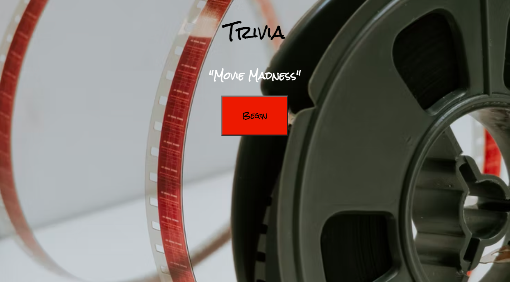

# Trivia

**Live Link:** [Movie Madness](https://charnaye95.github.io/MovieMadness/)

## Screenshots

## Technologies Used:
- HTML
- CSS
- JavaScript

## User Stories
MVP Goals
- As a player, I am able to see to be the bank self-score.

- As a player, I am able to recognize a correct answer or incorrect answer.

- As a player, I am able to restart another game after the questions have all been answered and the game is over.

Stretch Goals
- As a player, I would like to know the correct answer afterward, if answered incorrectly.

- As a player, I'd like a timer on the screen to know how much time is left to answer each question.

- As a player, I'd like to see an animation of the money counting up in the bank.

- As a player, it would be cool for a sound to be played based on whether money was won or lost if betting is implemented.

## Wireframes

## Unsolved Problems or Major Hurdles
- creating a timer to start over per question
- using API to pull in answers, I had the questions but trying to pull multiple choice answers was difficult
- getting the correct answer to highlight or alert the correct answer when the question is answer incorrectly

