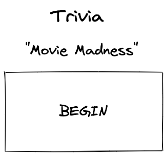

# Movie Madness - Trivia

**Live Link:** [alt text](link to game)

## Screenshots

## Technologies Used:
-HTML
-CSS
-JavaScript

## User Stories

## Wireframes

## Unsolved Problems or Major Hurdles
-creating a timer to start over per question
-using API to pull in answers, I had the questions but trying to pull multiple choice answers was difficult
-getting the correct answer to highlight or alert the correct answer when the question is answer incorrectly

## Sources Used: 

https://unsplash.com/photos/WevidclYpdc
https://code-boxx.com/allow-one-click-javascript/
https://bobbyhadz.com/blog/javascript-change-background-color-on-click
https://stackoverflow.com/questions/17390700/disabling-multiple-html-buttons